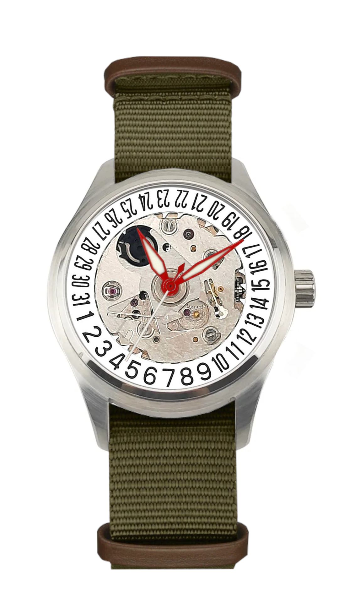
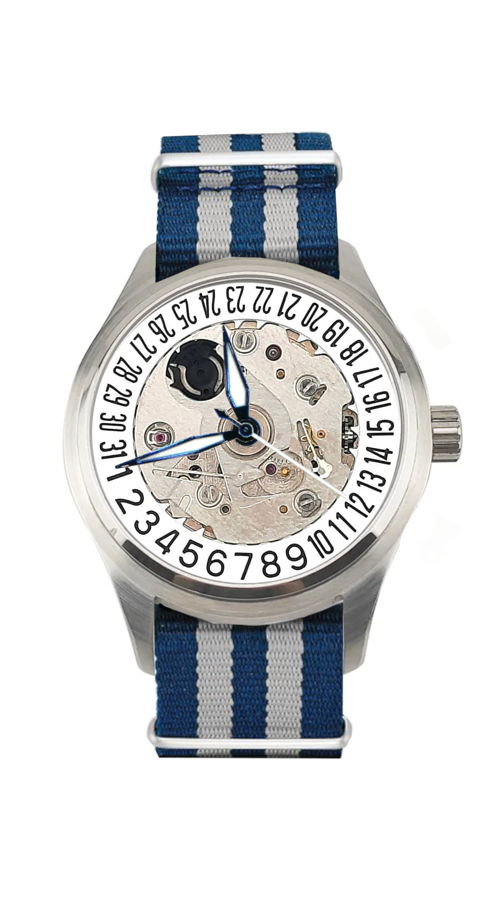

# Watches...
<!DOCTYPE html>
<html lang="en">
<head>
    <meta charset="UTF-8">
    <meta name="viewport" content="width=device-width, initial-scale=1.0">
    <link rel="stylesheet" href="styles.css"> 
</head>
<body>
    <header>
        <h1> </h1>
         
        <nav>
            <ul>
                <li><a href="#home">Home</a>
                <li><a href="#shop">Shop</a></li>
                <li><a href="#watches">Watches</a></li>
                <li><a href="#about">About us</a></li>
            </ul>
        </nav>

    <section id="home"
       <h1> William Severin Watches<h1> 
    </section>
<h2> Home </h2> 
    <section id="shop">
<h2> Shop </h2> 
<li></li> <li></li> 
    </section>
    <h2> Watches </h2>
    <section id= "watch 1" 
    <h2> William Severin One </h2> 
    
    <button> $249.99 Add to cart </button>
   

 Description 
 
    
 The <b> William Severin One </b> is a concept watch designed in house. It has no dial and features beautiful blue hands with an automatic movement and a nylon strap. 

   

   

 Specifications 
 
    
 Movement | Seiko NH35 (3 hand & date)   Case size | 40mm 
      Case material | Stainless Steel
      Crystal type | Saphire crystal
      Reference Number | WSW-1-22

   

   </section>
   <section id= "watch 2" 
   <h2> William Severin Two </h2> 
   
   <button> $249.99 Add to Cart</button>
  

 Description 
 
   
 The <b> William Severin Two </b> is a concept watch designed in house. It has no dial and features beautiful red hands with an automatic movement and a nylon strap. 

  

  

 Specifications 
 
   
 Movement | Seiko NH35 (3 hand & date)   Case size | 40mm 
     Case material | Stainless Steel 
     Crystal type | Saphire crystal
     Reference Number | WSW-2-22

  

  </section>
    
    <section id="about"
      <h2> About us </h2> 
      
 WSW was founded after our CEO, William, saw a watch that his friend had pulled apart, the watch had it dial pulled off and William fell in love with the design.  
        Using this 'no-dial' design William designed the company's first watch: the <b> William Severin One </b>. The <b> William Severin One </b> sported blue hands and a blue and white striped nato strap.  
        Later that year WSW released the <b> William Severin Two </b>, the <b> William Severin Two </b> features red hands and a Khaki strap while keeping the theme of not having a dial similar to the <b> William Severin One </b>   
        Now the company makes all sorts of watches tailored to the customers taste and is currently working on a sporty chronograph  

    </section>

 

    <footer>
        
    </footer>
  </header>
</body>
</html>

    
